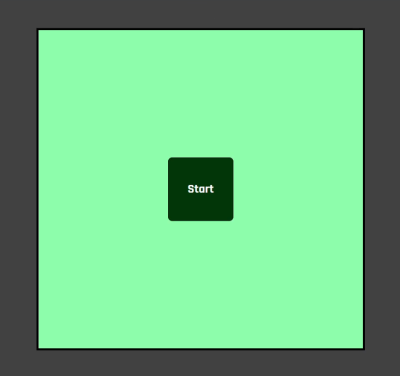
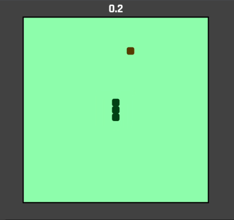
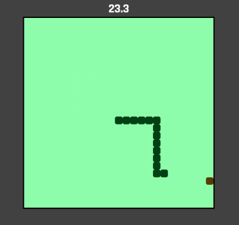
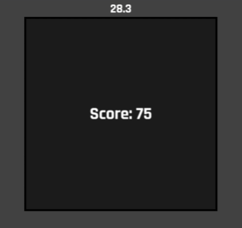

# Snake_JavaScript

Simple but classic Snake game made in JavaScript

Below you can see all the stages of the game. First you see a starting screen. If you press the start button

you will start the game. When you start the game a timer starts that shows you how long you have been playing.

As per usual you will get longer the more "food" your snake eats. When you hit a wall/yourself you will die and

that is when the score screen appears. This screen will show you what score you got. The score is based on

how long your snake were when you died.

